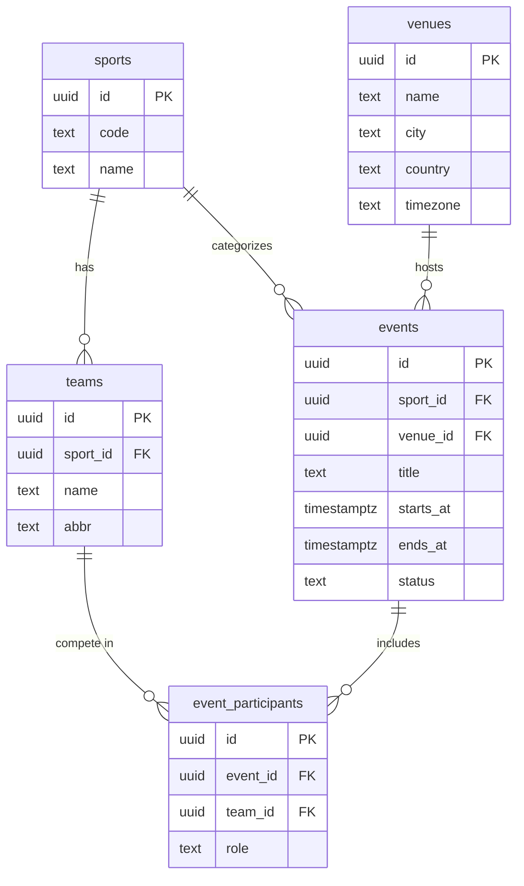

# Sports Events Domain Model

This doc defines the domain language + data model that we’ll use for the Sports Events product.

### Domain Terms

| Term                 | Meaning                                                             |
| -------------------- | ------------------------------------------------------------------- |
| **Sport**            | category of play (football, basketball, tennis, etc)                |
| **Team**             | club or participant that belongs to exactly 1 sport                 |
| **Venue**            | physical place where events happen                                  |
| **Event**            | scheduled contest (belongs to a sport + takes place at one venue)   |
| **EventParticipant** | link table to attach teams/participants to events (ex: home / away) |

### Base Assumptions

- PostgreSQL 16 (Docker) is the main datastore.
- Timestamps use `timestamptz` in UTC only.
- UUIDv4 for every primary key (`gen_random_uuid()`).
- `sport.code` is unique (`soccer`, `basketball`, etc.).
- Events can be drafted before participants are confirmed.
- If teams exist, they must match the event’s sport.
- Venues include capacity + timezone.

### ERD (Mermaid)

